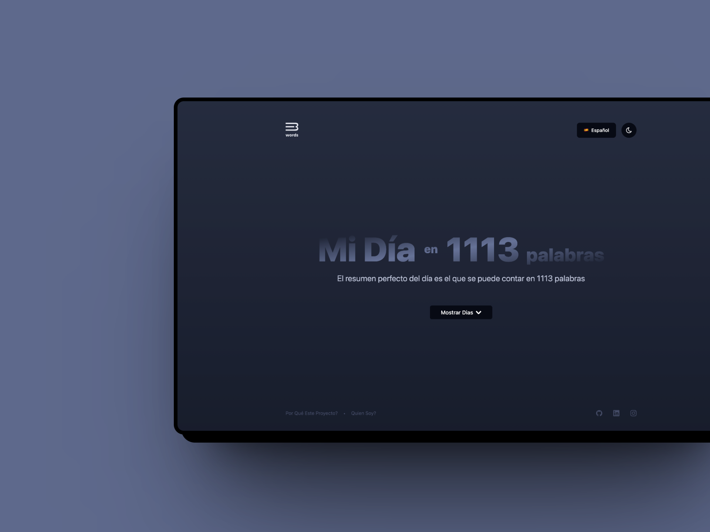

  
  <h1>1113 Words</h1>

 

Welcome to 1113 Word! This project offers a unique glimpse into daily experiences through succinct stories, each meticulously crafted with exactly 1113 words. In a world inundated with information overload, 1113 Word aims to captivate audiences with concise narratives that provide a snapshot of daily life.

## Features

1. **1113-Word Stories:** Experience the essence of a day distilled into precisely 1113 words. Each story is crafted to encapsulate the emotions, events, and reflections of a day, offering a window into diverse experiences.

2. **Diverse Themes:** Explore a wide range of themes and topics, from personal anecdotes to fictional narratives, from mundane routines to extraordinary adventures. Whether it's a tale of love and loss, a humorous anecdote, or a thought-provoking reflection, there's something for everyone.

3. **Engaging Narratives:** Immerse yourself in engaging narratives that evoke emotions, spark imagination, and provoke contemplation. Whether you're seeking inspiration, entertainment, or a moment of reflection, 1113 Word delivers stories that resonate.

4. **Daily Insights:** Follow along as each day unfolds through the lens of a 1113-word story. Gain insights into different perspectives, cultures, and lifestyles, fostering empathy and understanding in an increasingly interconnected world.

## Background

The inspiration behind 1113 Word stems from the desire to capture the essence of daily life in a succinct yet meaningful format. In a fast-paced world where attention spans are limited, 1113 Word offers a refreshing alternative—a bite-sized narrative that invites readers to pause, reflect, and connect with the stories woven within.

In a landscape where social media platforms thrive on brevity and instant gratification, 1113 Word dares to slow down the pace, offering a moment of contemplation and immersion in the richness of storytelling. Drawing inspiration from the tradition of flash fiction and microblogging, 1113 Word embraces the challenge of conveying depth and emotion within a constrained word count, proving that great stories can come in small packages.

While there may be alternatives to 1113 Word, what sets this project apart is its commitment to precision and artistry. Each story is meticulously crafted to ensure that every word carries weight, inviting readers on a journey of discovery and reflection. Whether you're a seasoned storyteller or a curious reader, 1113 Word promises an immersive experience that lingers long after the final word.

## Get Started

Explore the world of 1113 Word by visiting our website [here](https://youtube.com). Dive into a diverse collection of stories that promise to intrigue, inspire, and illuminate the beauty of everyday life—all in exactly 1113 words. Join us on this journey of storytelling and discovery, where every word matters.
